# Manual de Usuario — Sistema de Reservas

Este manual describe paso a paso el flujo completo del sistema: desde explorar los alojamientos disponibles hasta completar una reserva y recibir el comprobante de pago.

---

## 1. Vista principal — Catálogo de alojamientos

Al ingresar al sistema, el usuario ve el catálogo general con todas las sedes y apartamentos disponibles. Cada tarjeta muestra el nombre, ciudad, tipo de alojamiento, capacidad y precio base desde el que parte la estadía.

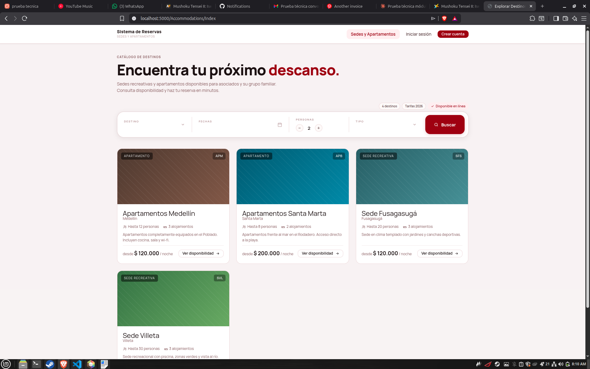

La barra de búsqueda en la parte superior permite filtrar el catálogo en tiempo real mediante cuatro criterios combinables:

- **Destino:** ciudad específica o todos los destinos disponibles.
- **Fechas:** selector de calendario doble para elegir check-in y check-out.
- **Personas:** contador de personas del grupo.
- **Tipo:** sede recreativa, apartamento o ambos.

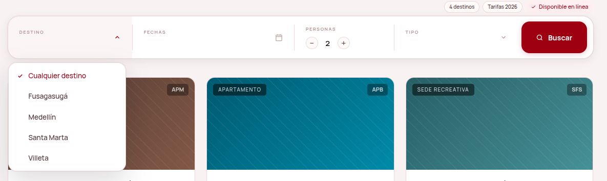
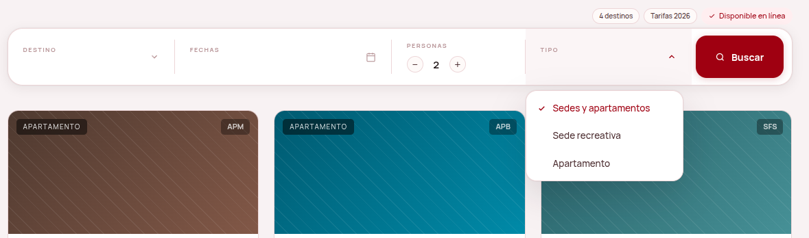
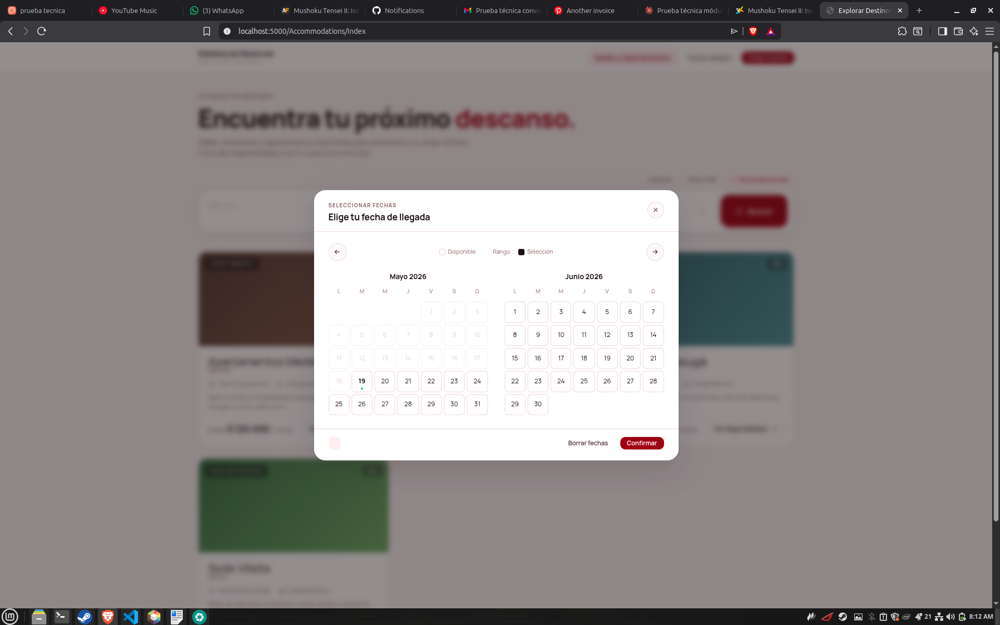

---

## 2. Cabecera de navegación

El encabezado del sistema es minimalista y siempre visible. Para usuarios no autenticados muestra el acceso a **Iniciar sesión** y **Crear cuenta**. Una vez autenticado, el menú lateral aparece con las secciones de la cuenta.

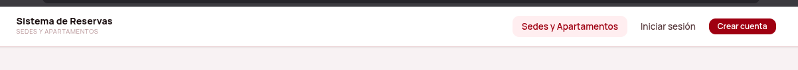

---

## 3. Acceso al sistema

### 3.1 Iniciar sesión

Desde el botón **Iniciar sesión** del encabezado se accede al formulario de autenticación. El usuario puede ingresar con su correo y contraseña, o bien autenticarse directamente con su cuenta de Google en un solo clic.

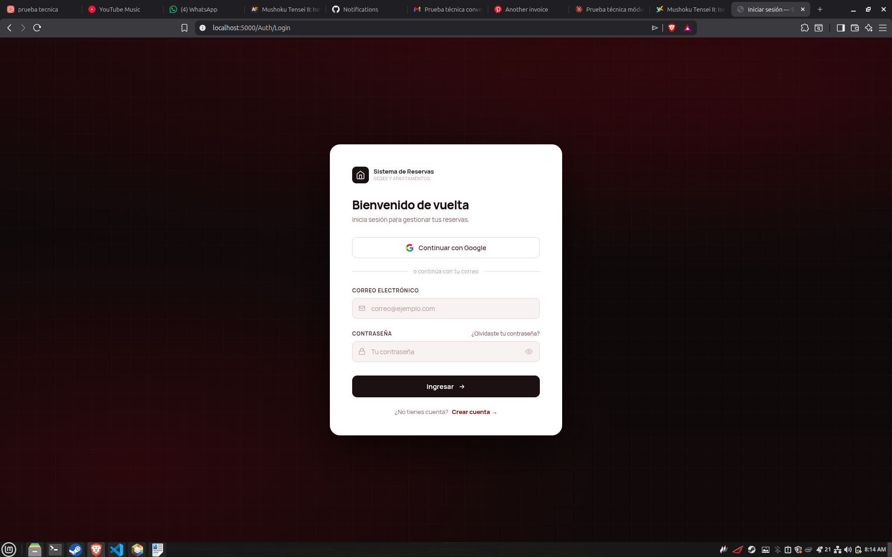
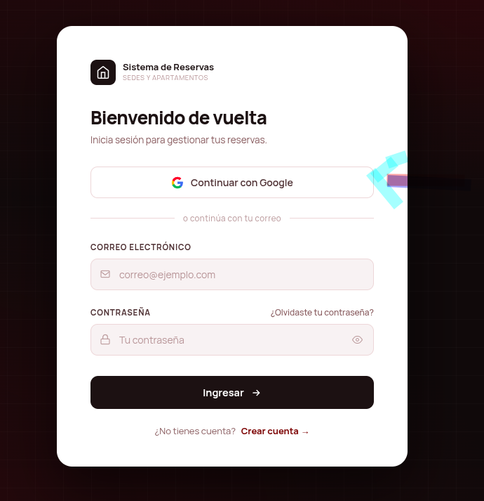

Si el usuario no recuerda su contraseña, el enlace **¿Olvidaste tu contraseña?** inicia el flujo de recuperación.

### 3.2 Crear cuenta

Para registrarse, el usuario completa los siguientes campos obligatorios: nombre completo, número de documento, correo electrónico, contraseña y confirmación de contraseña. También puede registrarse mediante Google, lo que omite el formulario y vincula la cuenta automáticamente.

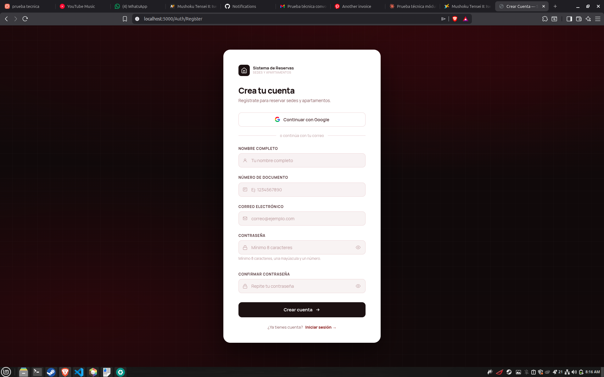

### 3.3 Recuperación de contraseña

Si el usuario olvidó su contraseña, ingresa su correo y el sistema envía un enlace de restablecimiento válido por 30 minutos.

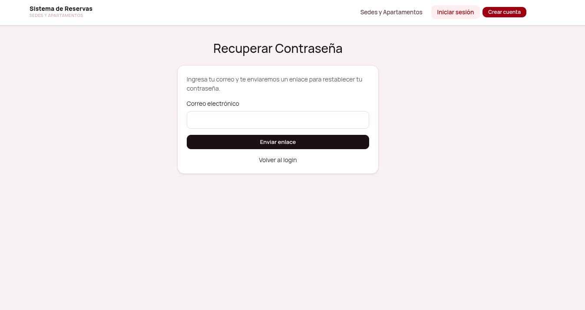

El correo recibido contiene un botón directo para restablecer la contraseña.

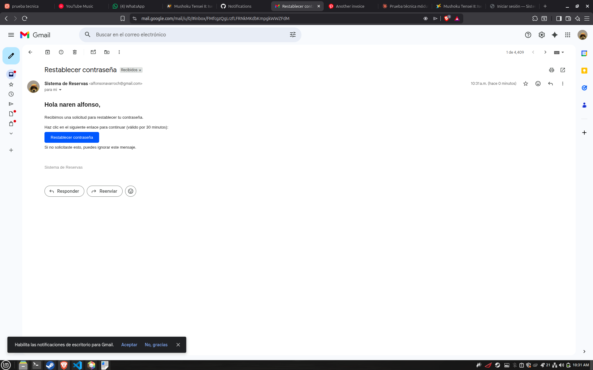

Al hacer clic en el enlace del correo, el usuario define su nueva contraseña. Debe tener mínimo 8 caracteres, una mayúscula y un número.

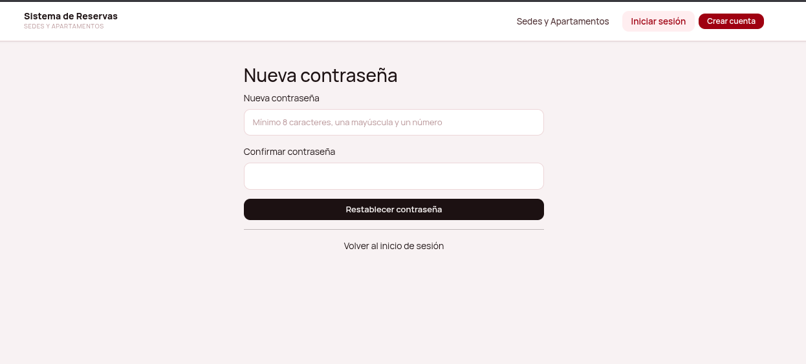

---

## 4. Detalle de un alojamiento

Al hacer clic en cualquier tarjeta del catálogo, se abre la página de detalle del alojamiento. Esta página está organizada en pestañas que permiten explorar toda la información antes de buscar disponibilidad.

### 4.1 Pestaña Alojamientos

Es la pestaña inicial. Si no se han ingresado fechas, el panel lateral solicita seleccionarlas para poder ver las habitaciones disponibles y sus precios.

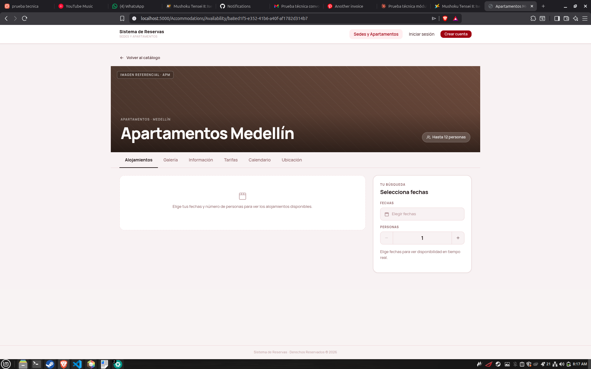

Al hacer clic en el campo de fechas se abre el selector de calendario. Las fechas marcadas en rojo corresponden a días ya reservados o bloqueados.

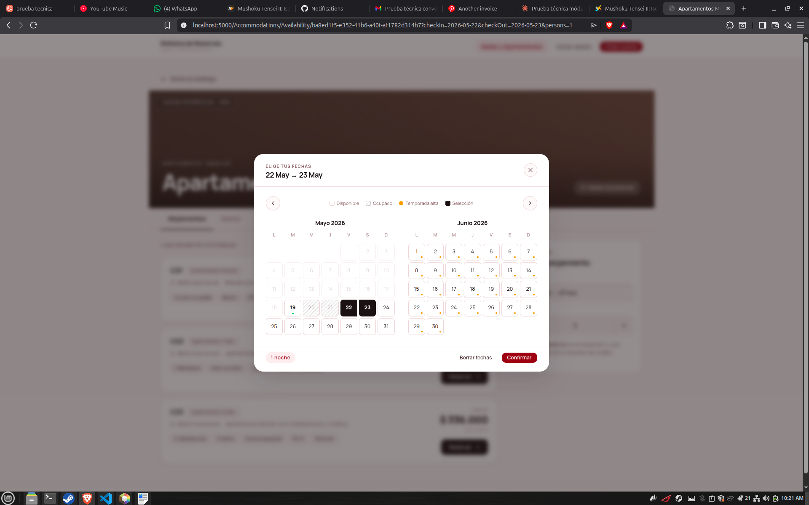

Una vez elegidas las fechas, la pestaña muestra las habitaciones disponibles con su precio calculado para esa estancia, amenidades y botón de selección.

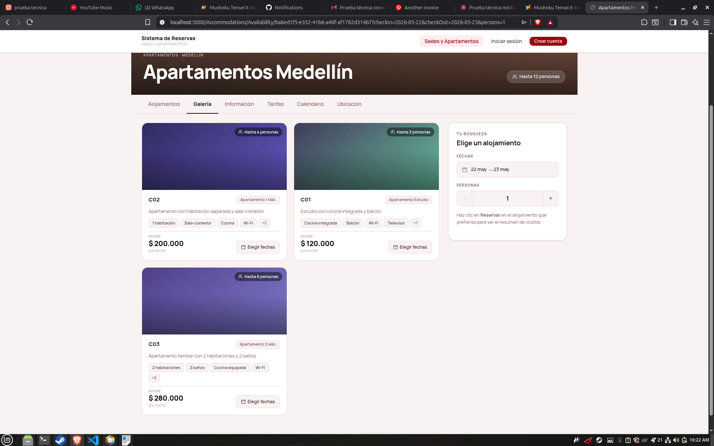

Cada tarjeta de habitación tiene un botón de galería que abre un modal con las fotografías del espacio, descripción detallada y amenidades incluidas.

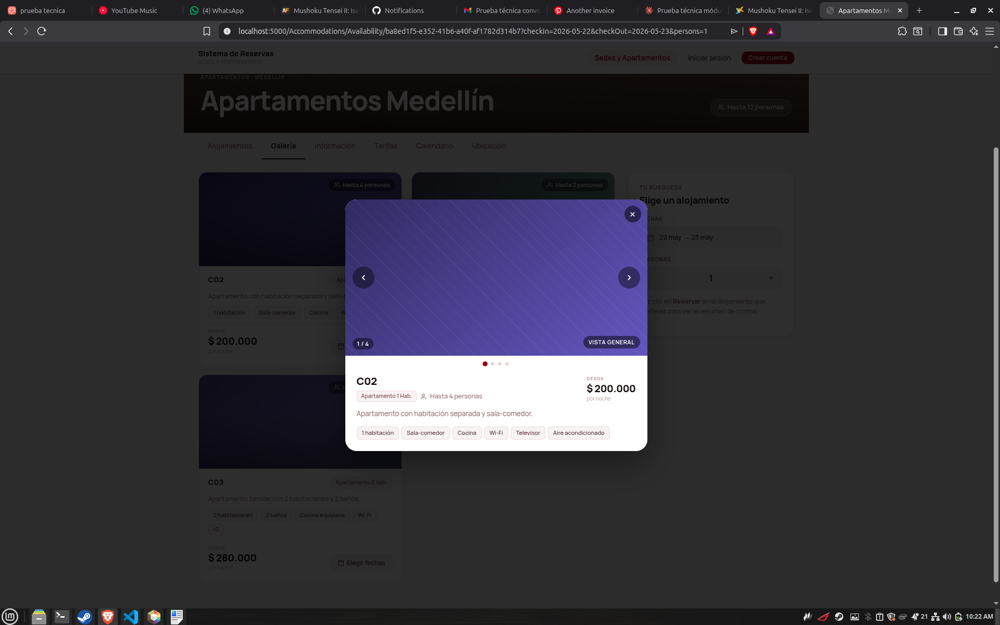

### 4.2 Pestaña Galería

Presenta todas las unidades del alojamiento en formato visual, con precios de referencia, tipo, capacidad y amenidades.

### 4.3 Pestaña Información

Muestra la descripción general del alojamiento, los servicios comunes incluidos (Wi-Fi, televisor, cocina equipada, aire acondicionado, entre otros) y datos generales como capacidad total, ciudad y tipo.

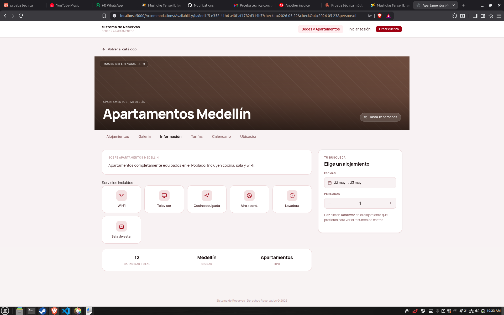

### 4.4 Pestaña Tarifas

Presenta la tabla de precios de todas las habitaciones, con la tarifa en temporada baja y alta. Incluye una nota explicativa sobre la **tarifa especial de lunes a jueves**, que aplica un descuento automático según la fecha de check-in seleccionada.

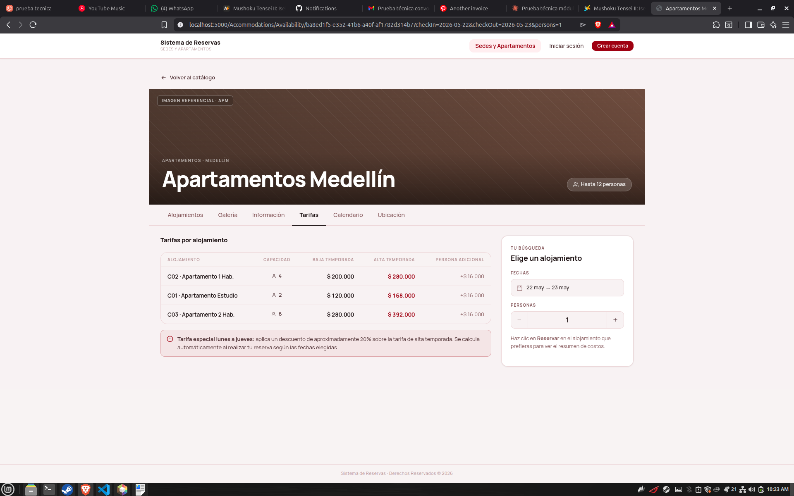

### 4.5 Pestaña Calendario

Muestra la disponibilidad de los próximos 62 días en un calendario visual. Los días marcados indican fechas ya ocupadas (en rojo) y los días libres se muestran sin color. Útil para planificar la estadía antes de seleccionar fechas específicas.

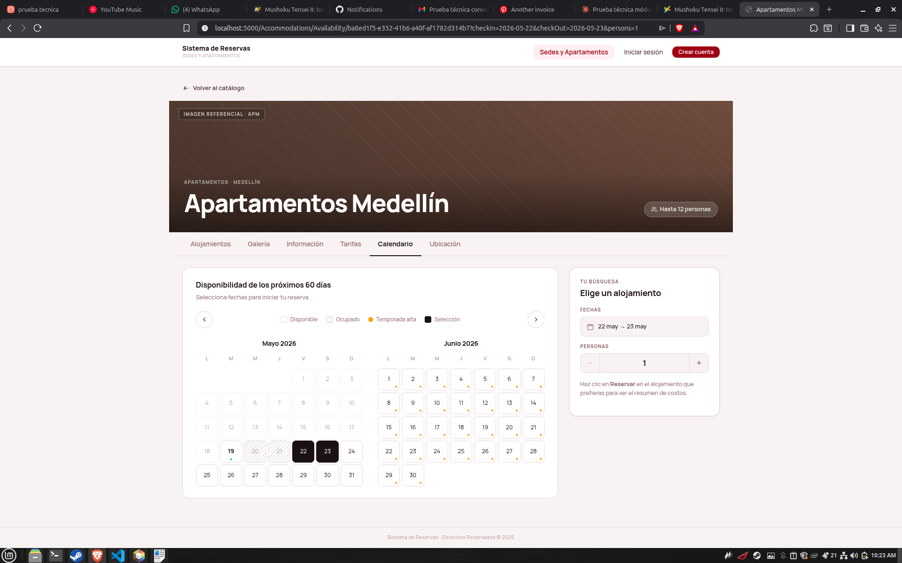

### 4.6 Pestaña Ubicación

Muestra la dirección exacta del alojamiento y botones de acceso directo a Google Maps y OpenStreetMap para consultar la ruta.

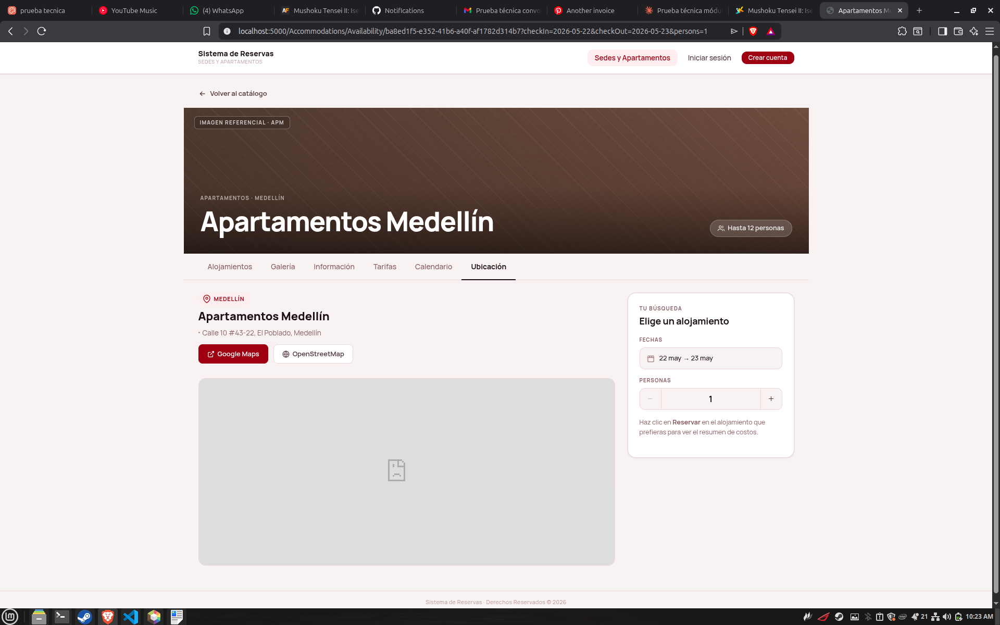

---

## 5. Selección de habitación e inicio de reserva

Con fechas ingresadas, la pestaña Alojamientos muestra los espacios disponibles para el rango seleccionado. El panel lateral derecho actúa como resumen de la selección en tiempo real: al hacer clic en **Seleccionar** sobre una habitación, el panel se actualiza mostrando el desglose de costos.

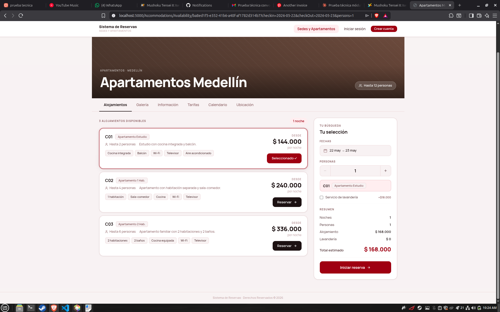

El panel muestra:
- **Fechas** de check-in y check-out
- **Habitación seleccionada** con su código y tipo
- **Checkbox de lavandería** — servicio opcional con costo fijo de $18.000 por estancia
- **Resumen de costos:** noches, personas, valor de alojamiento, lavandería y total estimado
- Botón **Iniciar reserva** para continuar al proceso de confirmación

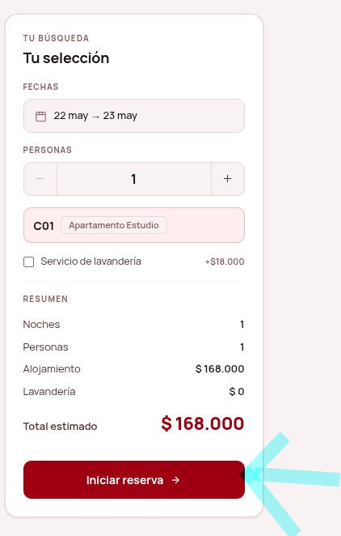

---

## 6. Confirmar reserva

Al hacer clic en **Iniciar reserva**, el sistema redirige a la página de confirmación. Aquí se muestra el resumen completo antes de crear la reserva:

- **Detalle del alojamiento:** tipo, capacidad, fechas, noches y temporada aplicada
- **Resumen de costos:** costo base, personas adicionales y total estimado
- **Opciones:** activar o desactivar el servicio de lavandería (el precio se actualiza automáticamente)
- **Observaciones:** campo opcional para indicar necesidades especiales, hora estimada de llegada, alergias, etc.

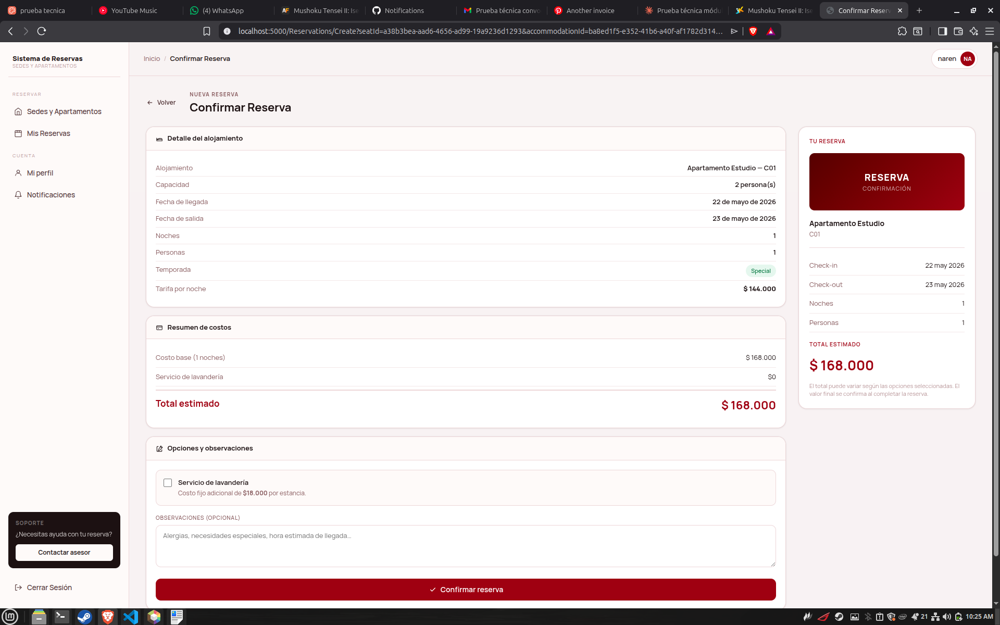
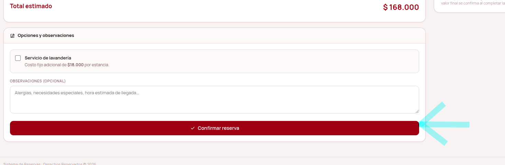

Al hacer clic en **Confirmar reserva** la reserva queda registrada en el sistema con estado *Pendiente* y el usuario es redirigido al flujo de pago.

---

## 7. Proceso de pago

El pago se completa en dos pasos.

### Paso 1 — Método de pago

El usuario selecciona su método de pago preferido:

- **PSE** — débito bancario directo (se elige la entidad bancaria)
- **Tarjeta de crédito** — Visa, Mastercard, Amex
- **Descuento de nómina** — hasta 3 cuotas sin interés

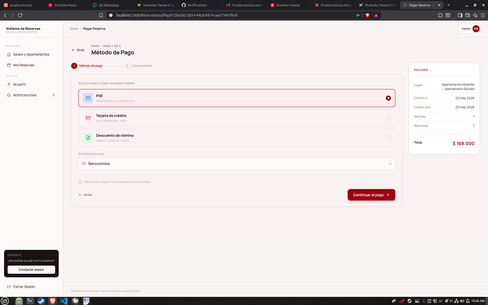

### Paso 2 — Adjuntar comprobante

Tras elegir el método, el usuario adjunta el comprobante de la transacción realizada (JPG, PNG o PDF, máximo 5 MB). El equipo revisará el pago y confirmará la reserva en las próximas horas hábiles.

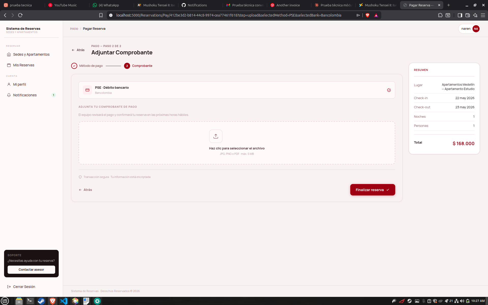
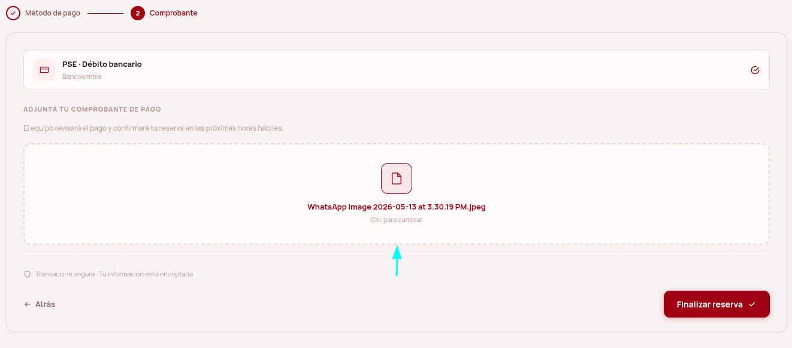

Al finalizar, el sistema envía un correo de confirmación al usuario con el ticket de reserva adjunto en formato PDF.

---

## 8. Correo de confirmación y ticket PDF

El usuario recibe un correo indicando que el comprobante fue recibido exitosamente. El correo incluye el número de ticket de la reserva y el archivo PDF adjunto como constancia formal de la transacción.

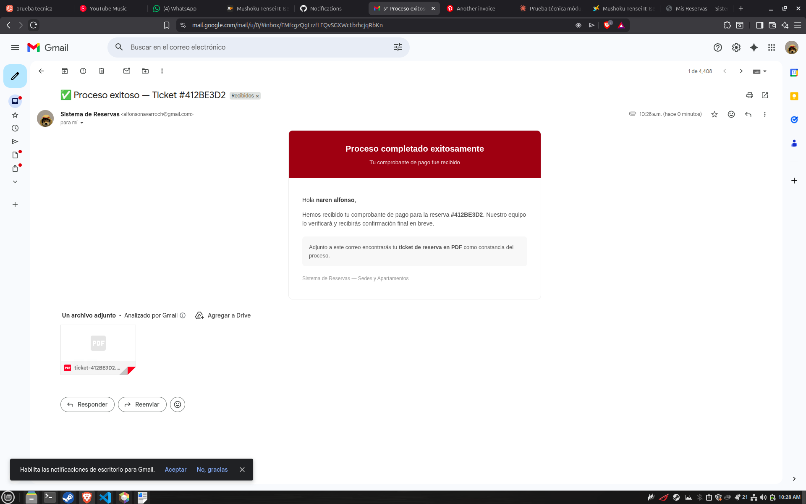

El ticket PDF contiene el detalle completo: nombre del usuario, alojamiento, fechas, descripción del servicio, valor total y estado actual del proceso.

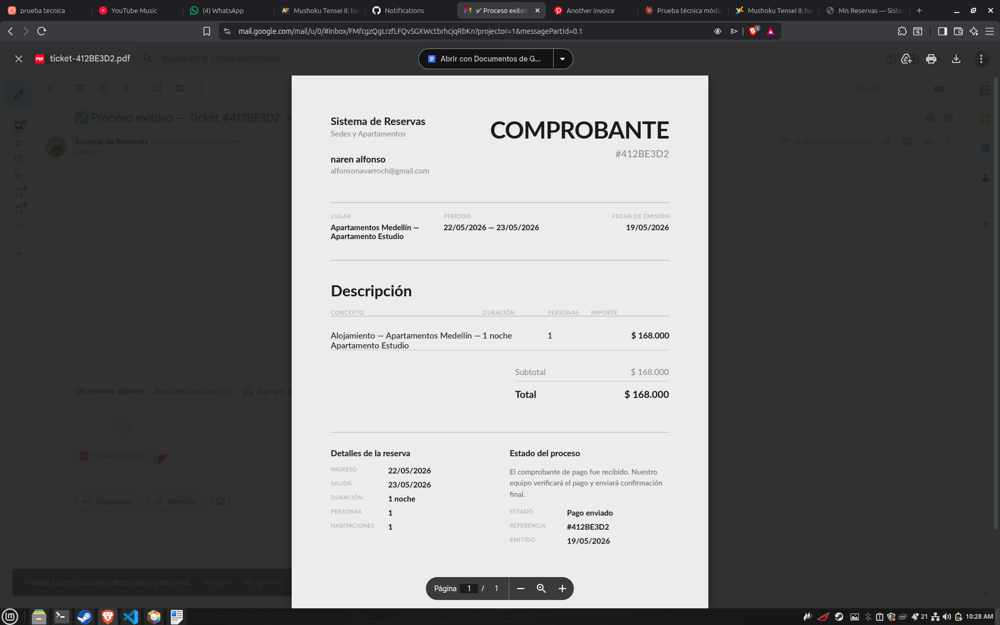

---

## 9. Mis Reservas — Panel de control

Desde el menú lateral, la sección **Mis Reservas** muestra todas las reservas del usuario en una tabla con la siguiente información por fila:

- Lugar y tipo de alojamiento
- Fechas de reserva, llegada y salida
- Número de personas y habitaciones
- Valor total
- Estado actual (Pendiente, Pago enviado, Confirmado, etc.)
- Acceso al comprobante de pago enviado
- Descarga del ticket PDF
- Opción para cancelar la reserva

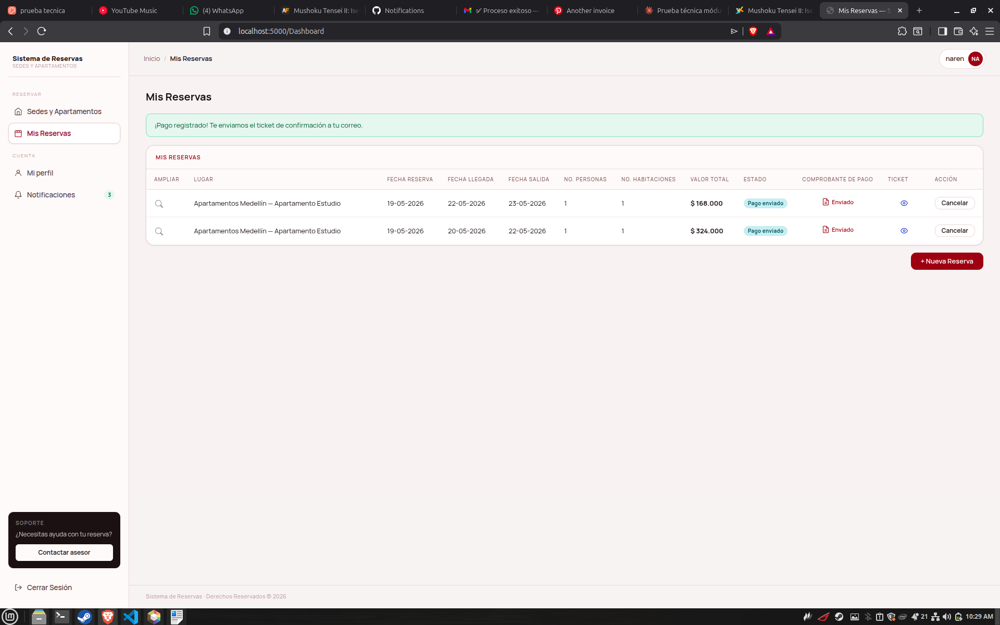

---

## 10. Notificaciones

El ícono de campana en el menú lateral muestra el número de notificaciones sin leer. Al ingresar a la sección **Notificaciones** se listan todos los eventos relevantes de las reservas: recepción de comprobante, confirmación de reserva, actualizaciones de estado, etc.

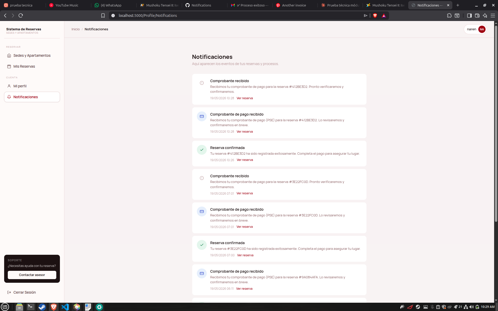

---

## 11. Mi Perfil

En la sección **Mi Perfil** el usuario puede consultar los datos de su cuenta (correo verificado, número de documento y fecha de registro) y editar su nombre completo y número de teléfono.

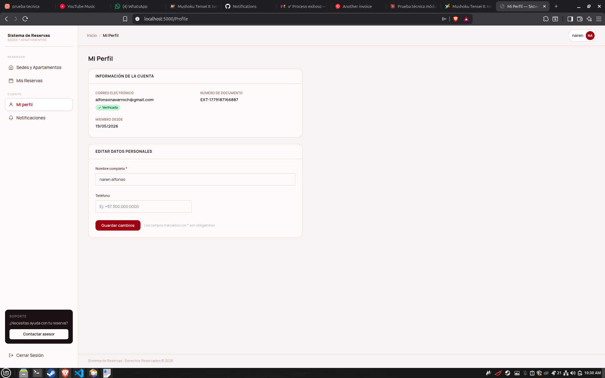
